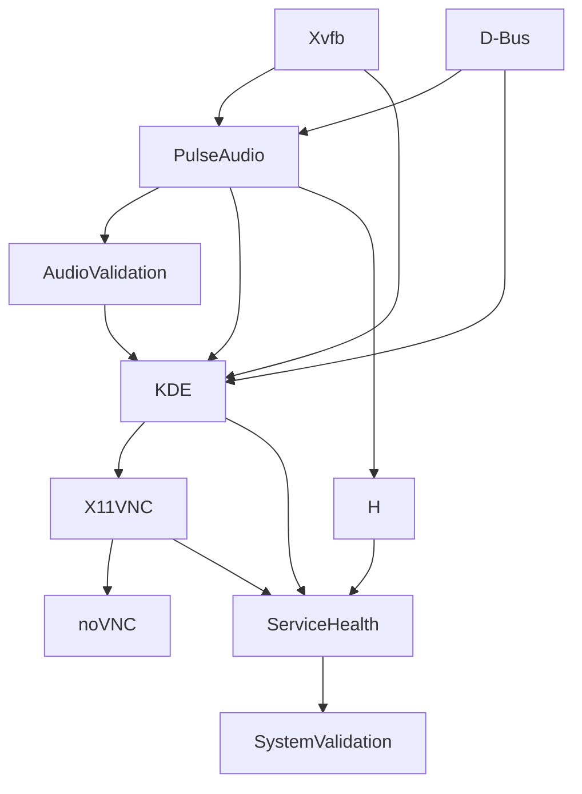

# Service Architecture Guide

## Service Overview

The Ubuntu KDE Docker container uses supervisord to manage multiple services with dependencies and priorities. The system also supports background building for efficient container management.

## Service Hierarchy

### Core Infrastructure (Priority 10-20)
Services that other components depend on.

#### Xvfb (Priority 10)
- **Purpose**: Virtual X11 display server
- **Port**: Display :1
- **Dependencies**: None
- **Status**: Always running
- **Critical**: Yes - Required for all GUI applications

#### D-Bus (Priority 15) 
- **Purpose**: Desktop message bus system
- **Dependencies**: None
- **Status**: Always running  
- **Critical**: Yes - Required for KDE desktop communication

### Audio System (Priority 25-30)
Container-compatible audio infrastructure.

#### PulseAudio (Priority 25)
- **Purpose**: Audio server with virtual devices
- **Port**: 4713 (TCP)
- **Dependencies**: Xvfb, D-Bus
- **Configuration**: Uses virtual sinks for container compatibility
- **Critical**: Yes - Required for audio functionality

#### AudioValidation (Priority 28)
- **Purpose**: Creates and validates virtual audio devices
- **Dependencies**: PulseAudio
- **Status**: Runs once, then exits
- **Critical**: Yes - Sets up `virtual_speaker` and `virtual_microphone`

#### AudioMonitor (Priority 30)
- **Purpose**: Continuous audio system monitoring
- **Dependencies**: PulseAudio, AudioValidation
- **Status**: Continuous monitoring
- **Critical**: No - Monitoring only

### Desktop Environment (Priority 35)
KDE Plasma desktop session.

#### KDE (Priority 35)
- **Purpose**: Full KDE Plasma desktop environment
- **Dependencies**: Xvfb, D-Bus, PulseAudio
- **User**: devuser
- **Display**: :1
- **Critical**: Yes - Main desktop interface

### Remote Access Services (Priority 40-50)
Multiple methods for accessing the desktop remotely.

#### X11VNC (Priority 40)
- **Purpose**: VNC server for desktop sharing
- **Port**: 5901
- **Dependencies**: KDE, Xvfb
- **Authentication**: Password-based
- **Critical**: Yes - Primary remote access method

#### noVNC (Priority 45)
- **Purpose**: Web-based VNC client
- **Port**: 80 (HTTP)
- **Dependencies**: X11VNC
- **Access**: `http://localhost:80`
- **Critical**: Yes - Web interface for VNC

- **Features**: Audio forwarding, better compression
- **Critical**: Yes - Advanced remote access

#### SSH (Priority 46)
- **Purpose**: Secure shell access
- **Port**: 22
- **Dependencies**: None
- **User**: devuser
- **Critical**: No - Alternative access method

#### TTYD (Priority 48)
- **Purpose**: Web-based terminal
- **Port**: 7681 (HTTP)
- **Dependencies**: None
- **Access**: `http://localhost:7681`
- **Critical**: No - Web terminal interface

### Monitoring and Setup (Priority 50-60)
System validation and health monitoring.

#### ServiceHealth (Priority 52)
- **Purpose**: Service health monitoring
- **Dependencies**: All core services
- **Status**: Continuous monitoring
- **Critical**: No - Monitoring only

#### SetupDesktop (Priority 55)
- **Purpose**: Desktop customization and shortcuts
- **Dependencies**: KDE
- **Status**: Runs once
- **Critical**: No - Desktop enhancements

#### SystemValidation (Priority 60)
- **Purpose**: Comprehensive system validation
- **Dependencies**: All services
- **Status**: Runs after all services start
- **Critical**: No - Validation and reporting

## Service Dependencies



## Service Configuration

### Startup Sequence
1. **Infrastructure**: Xvfb, D-Bus start first
2. **Audio**: PulseAudio with virtual device setup
3. **Desktop**: KDE Plasma desktop environment
4. **Remote Access**: VNC, SSH, TTYD services
5. **Validation**: Health monitoring and system validation

### Service Scripts Location
- **Main config**: `/etc/supervisor/conf.d/supervisord.conf`
- **Service scripts**: `/usr/local/bin/`
- **Logs**: `/var/log/supervisor/`

## Port Mapping

| Port | Service | Protocol | Purpose |
|------|---------|----------|---------|
| 80 | noVNC | HTTP | Web VNC client |
| 22 | SSH | SSH | Secure shell |
| 5901 | X11VNC | VNC | VNC server |
| 7681 | TTYD | HTTP | Web terminal |

| 4713 | PulseAudio | TCP | Audio server |

## Service Management

### Supervisord Commands
```bash
# View all service status
docker exec webtop-kde supervisorctl status

# Start/stop specific service
docker exec webtop-kde supervisorctl start <service>
docker exec webtop-kde supervisorctl stop <service>
docker exec webtop-kde supervisorctl restart <service>

# View service logs
docker exec webtop-kde supervisorctl tail <service>
docker exec webtop-kde supervisorctl tail -f <service>

# Clear service logs
docker exec webtop-kde supervisorctl clear <service>
```

### Service-Specific Management

#### Audio Services
```bash
# Restart audio system
docker exec webtop-kde supervisorctl restart pulseaudio AudioValidation

# Check audio devices
docker exec webtop-kde pactl list short sinks
```

#### Desktop Services
```bash
# Restart desktop
docker exec webtop-kde supervisorctl restart KDE

# Check desktop processes
docker exec webtop-kde ps aux | grep plasma
```

#### Remote Access Services
```bash
# Restart VNC services
docker exec webtop-kde supervisorctl restart X11VNC noVNC


# Test port accessibility
docker exec webtop-kde netstat -tlnp | grep -E "(80|5901|7681)"
```

## Service Health Monitoring

### Automatic Health Checks
- **ServiceHealth**: Monitors service status and restarts failed services
- **SystemValidation**: Validates complete system functionality
- **AudioMonitor**: Monitors audio system health

### Manual Health Checks
```bash
# Complete system validation
docker exec webtop-kde /usr/local/bin/system-validation.sh

# Service health report
docker exec webtop-kde /usr/local/bin/service-health.sh status

# Audio system check
docker exec webtop-kde /usr/local/bin/audio-monitor.sh check
```

## Troubleshooting Services

### Common Service Issues

#### Service Won't Start
```bash
# Check dependencies
docker exec webtop-kde supervisorctl status

# Review service logs
docker exec webtop-kde supervisorctl tail <service>

# Check configuration
docker exec webtop-kde cat /etc/supervisor/conf.d/supervisord.conf
```

#### Service Keeps Restarting
```bash
# Check resource usage
docker exec webtop-kde free -h
docker exec webtop-kde df -h

# Review error logs
docker exec webtop-kde supervisorctl tail <service>

# Check for conflicts
docker exec webtop-kde ps aux | grep <service>
```

#### Port Conflicts
```bash
# Check port usage
docker exec webtop-kde netstat -tlnp

# Check for external conflicts
netstat -tlnp | grep -E "(80|5901|7681|22)"
```

### Service Recovery Procedures

#### Complete Service Reset
```bash
# Stop all services
docker exec webtop-kde supervisorctl stop all

# Start core services first
docker exec webtop-kde supervisorctl start Xvfb dbus pulseaudio

# Wait for stability
sleep 10

# Start desktop
docker exec webtop-kde supervisorctl start AudioValidation KDE

# Wait for desktop
sleep 15

# Start remote access
docker exec webtop-kde supervisorctl start X11VNC noVNC sshd ttyd

# Start monitoring
docker exec webtop-kde supervisorctl start ServiceHealth SystemValidation
```

#### Selective Service Restart
```bash
# Restart audio chain
docker exec webtop-kde supervisorctl restart pulseaudio AudioValidation AudioMonitor

# Restart remote access chain
docker exec webtop-kde supervisorctl restart X11VNC noVNC
```

## Service Customization

### Adding New Services
1. **Create service script** in `/usr/local/bin/`
2. **Add to supervisord.conf** with appropriate priority
3. **Set dependencies** through priority ordering
4. **Test service startup** and integration

### Modifying Service Configuration
1. **Edit supervisord.conf** for service parameters
2. **Update service scripts** for functionality changes
3. **Rebuild container** to apply changes (use background build for efficiency)
4. **Validate service integration**

## Background Build Architecture

### Build Process Management
The system supports background building to minimize downtime and improve development workflow:

```bash
# Background build process
./webtop.sh build-bg [--dev|--prod]  # Starts detached Docker build
./webtop.sh build-status             # Monitors build progress
./webtop.sh build-logs               # Views build output
./webtop.sh build-stop               # Terminates build process
./webtop.sh build-cleanup            # Cleans build artifacts
```

### Build Lifecycle
1. **Initialization**: Build process starts in detached mode
2. **Progress Tracking**: Status monitoring via build-status command
3. **Log Management**: Real-time log viewing and analysis
4. **Completion**: Automatic cleanup and readiness notification
5. **Integration**: Seamless integration with service startup

### Build Monitoring & Logging
- **Real-time Status**: Continuous build progress monitoring
- **Log Analysis**: Detailed build output for troubleshooting
- **Resource Tracking**: Monitor disk space and build performance
- **Error Handling**: Automatic error detection and reporting

---

For troubleshooting specific service issues, see [TROUBLESHOOTING.md](TROUBLESHOOTING.md)